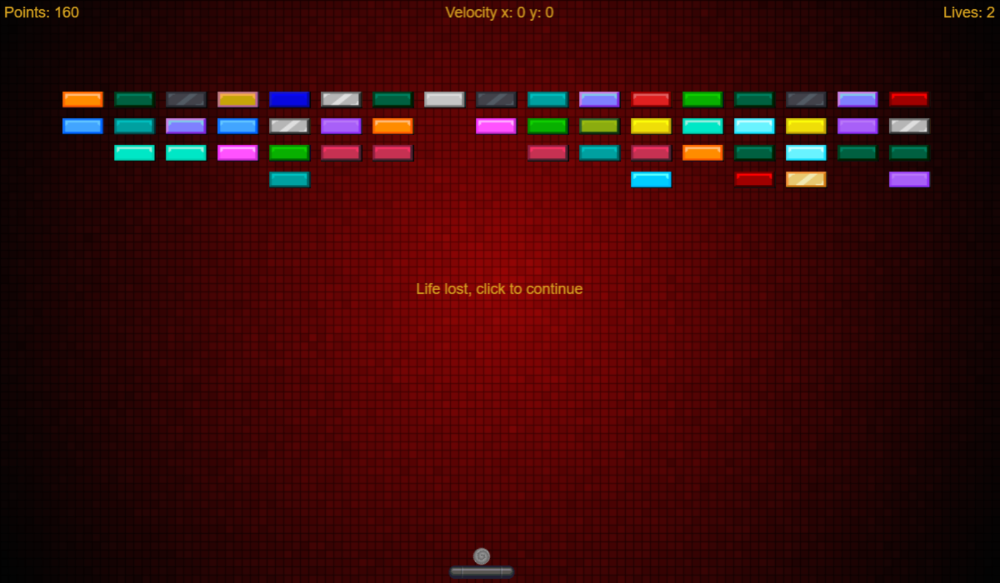
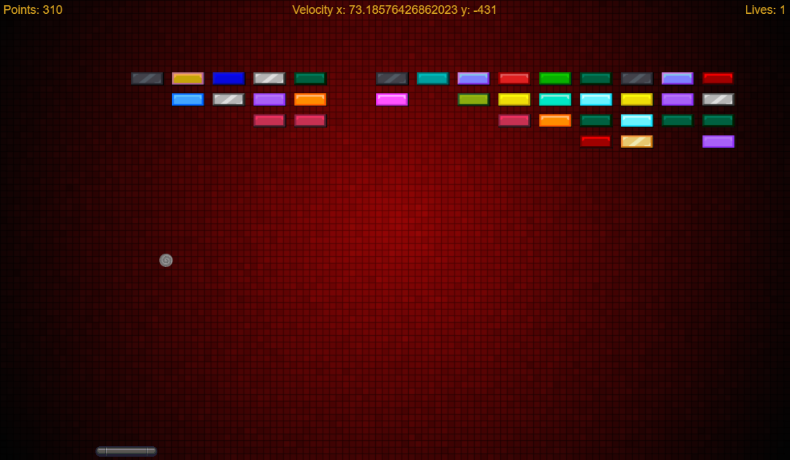
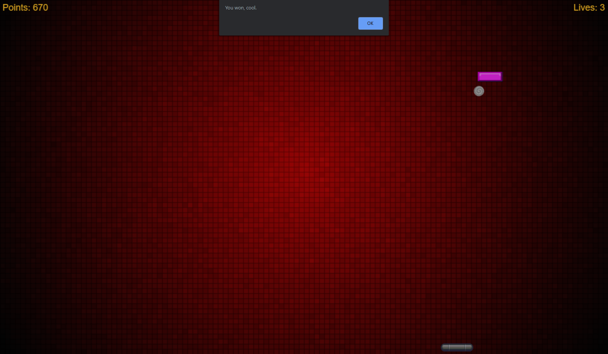
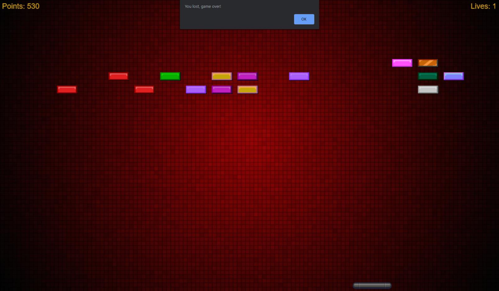

# Brick_Breaker_Clone

## A simple clone of one of my favorite childhood games, Brick Breaker!

This is my Brick Breaker clone, written in JavaScript using the Phaser 2.0 framework
and displayed with an HTML page using either a canvas element or WebGL, depending on the browser being used.

This game consists of three major components, these being the bricks, the ball and the paddle.
Using the paddle to bounce the ball back and forth, the game is won when the ball has hit all
the remaining bricks. There are a couple mechanics involved with this game as well. One
mechanic is a Life counter and the other is a paddle that increases in size when a Life
is lost. The controls are limited to the mouse cursor, the paddle will follow the mouse and
keep it centered during the game. When a life is lost, the ball is reset back to the paddles position
until it is launched with a life click. The velocity of the ball is determined by its current X and Y
positions. These positions are picked in a somewhat random fashion to keep the ball from going in the
same direction and at the same speed repeatedly. I left a label at the top of the game which shows the
balls current velocity. This was used to tweak some of the other mechanics.

The code for this project was initially all located in the html file. I have split it up
into separate JS files and functions for readability.

To play the game, all you need to do is download or fork the repo and open the **index.html**
page while it is in the same directory as the res and js folders.

I hope it brings a little nostalgia back!

